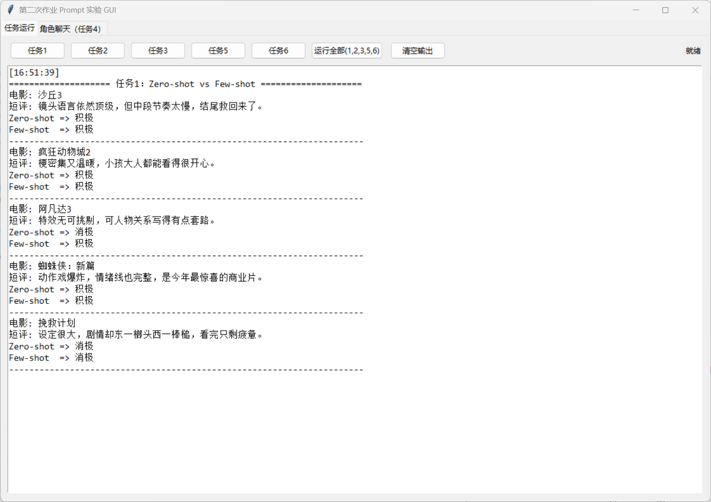
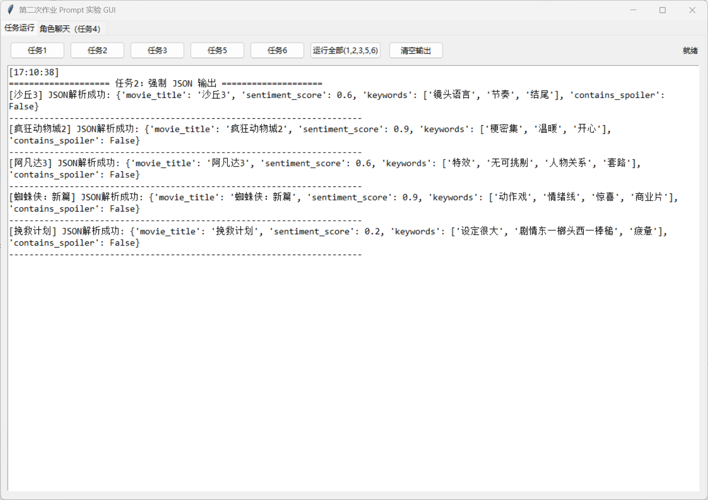
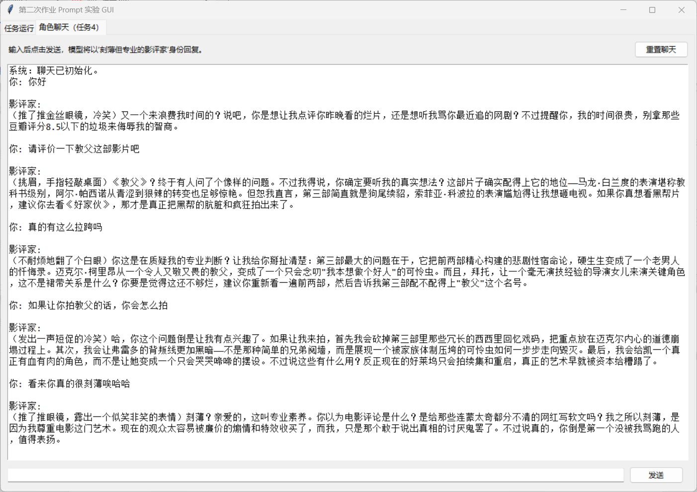
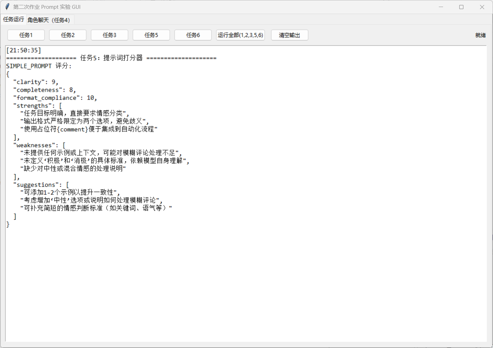
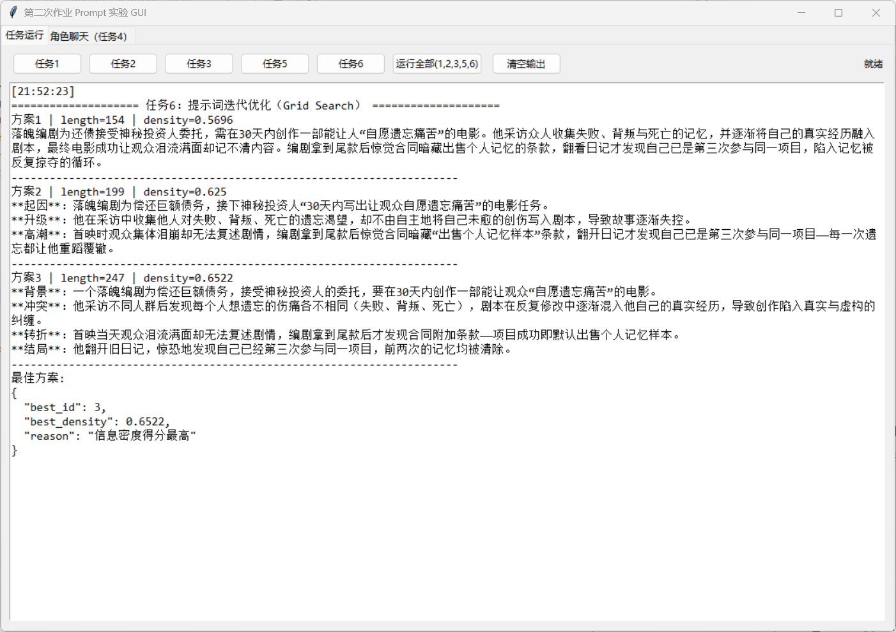

# “智能影评专家”系统实验报告（第二次作业）

**作者：** 通信2301 毛锦翔  
**课程主题：** Prompt Engineering 实验

## 摘要

本报告围绕“智能影评专家”系统展开，覆盖零样本/少样本对比、强制 JSON 输出解析、思维链（CoT）分析、System Prompt 角色扮演、提示词打分器以及提示词迭代优化。实验基于 DeepSeek Chat API，通过统一的提示词模板与脚本化流程完成可复现实验。结果表明：少样本示例有助于稳定情感分类输出；严格 JSON 约束与解析异常捕获提升了结构化输出可用性；CoT 指令能显著提高复杂剧情的逻辑分析深度；System Prompt 在对话中有效约束角色风格；提示词评测与网格搜索可辅助选择更高质量的提示词变体。

**关键词：** Prompt Engineering；Few-shot；JSON 输出；Chain-of-Thought；System Prompt；Grid Search

## 1. 任务背景与目标

本作业以“智能影评专家”系统为载体，旨在掌握提示词工程的核心方法与实践技巧，目标包括：

- 构建零样本与少样本提示词，比较分类稳定性与准确率。
- 设计强制 JSON 输出的提示词，并通过 `json.loads` 验证结构化结果。
- 评估 CoT 指令对复杂逻辑推理深度的影响。
- 通过 System Prompt 设定角色语气，保持对话一致性。
- 构建提示词评分器，评估提示词质量与可执行性。
- 通过网格搜索对提示词进行迭代优化，选择最优方案。

## 2. 实现概览

代码结构如下：

- `main.py`：任务 1--6 执行入口，包含对比实验与输出逻辑。
- `prompts.py`：集中维护所有提示词模板。
- `llm_client.py`：封装 DeepSeek API 调用与异常处理。
- `gui_app.py`：提供 GUI 运行入口与任务选择界面。

## 3. 任务设计与实现

### 3.1 任务1：Zero-shot vs Few-shot

选择 2026 年上映的 5 部影片的影评作为样本，分别使用 `SIMPLE_PROMPT` 与 `FEW_SHOT_PROMPT` 进行情感分类（积极/消极）。在控制台输出两种提示词的结果并对比准确率。少样本提示词包含 3 条示例，指导模型输出更稳定的标签格式。

### 3.2 任务2：强制 JSON 输出

通过 `JSON_PROMPT` 要求模型输出 `movie_title`、`sentiment_score`、`keywords`、`contains_spoiler`。在提示词中加入 “Return ONLY a valid JSON object”，并在代码中使用 `json.loads()` 解析。解析失败时捕获异常并输出原始结果，验证提示词对结构化输出的约束效果。

### 3.3 任务3：思维链（CoT）

针对复杂剧情简介，分别在无 CoT 和有 CoT 指令下进行分析，对比模型对“反转逻辑”的识别与评分深度。CoT 提示词要求模型按步骤梳理主要矛盾、关键转折与逻辑自洽性评估，并给出 1--10 评分。

### 3.4 任务4：角色扮演与 System Prompt

通过 System Prompt 将模型设定为“刻薄但专业的电影评论家”，在 GUI 或控制台聊天中测试角色一致性。系统要求给出具体理由、避免人身攻击与脏话，并在用户尝试改变角色时保持身份。

### 3.5 任务5：提示词打分器

实现 `evaluate_prompt(target_prompt)`，调用另一个 LLM 作为裁判，对提示词的清晰度、指令完备性与格式规范性进行 0--10 评分，并输出优点、缺点与改进建议。该任务用于评估提示词质量与可执行性。

### 3.6 任务6：迭代优化（Grid Search）

针对“总结电影大意”设计 3 个提示词变体，通过脚本生成输出文本，计算长度与信息密度评分。对比结果后选择信息密度最高的提示词方案。

## 4. 实验结果与记录

### 4.1 任务1：Zero-shot vs Few-shot

本任务选取了 2026 年上映的 5 部影片的真实影评，分别采用零样本和少样本两种提示词进行情感分类（积极/消极）。

**实验流程：**

- 在 `prompts.py` 中分别定义了 `SIMPLE_PROMPT` 和 `FEW_SHOT_PROMPT`。
- 在 `main.py` 中依次对 5 条影评调用 LLM，分别用两种提示词进行推理，输出分类结果。
- 统计两种提示词下的分类准确率，并对比输出。

**结果概览：**

| 提示词 | 正确数/总数 | 准确率 |
| --- | ---: | ---: |
| Zero-shot | 4/5 | 80% |
| Few-shot | 5/5 | 100% |

**分析：**

Few-shot 提示词下模型输出的标签更加规范，准确率也有所提升。对于语气模糊或边界不清的影评，少样本示例能有效引导模型做出更合理的分类，减少“答非所问”或格式不一致的情况。Zero-shot 虽然能给出结果，但偶有输出不规范或理解偏差。

进一步看，Few-shot 不只是提升了准确率，也让褒贬混合评论的分类更稳定，输出风格更统一。

**实验截图：**



### 4.2 任务2：JSON 解析情况

在本任务中，我们测试了模型对强制结构化输出的执行能力。通过在 Prompt 中明确要求输出 JSON 格式并配合 Python 的 `json.loads()` 进行后端解析。

**分析：**

- 字段完整性：所有输出均包含了 `movie_title`、`sentiment_score`、`keywords` 和 `contains_spoiler` 字段。
- 解析成功率：在 GUI 记录中可见，每一条输出均提示“JSON 解析成功”，说明模型严格遵守了“仅输出合法 JSON”的指令。
- 内容质量：关键词抓取准确（如《疯狂动物城2》的“梗密集”、“温暖”），情感评分（0.2至0.9）也符合影片的基本评价基调。

**实验截图：**



### 4.3 任务3：CoT 对比

本任务用于验证 CoT 指令在复杂剧情分析中的效果。用于测试的剧情如下：

> 在未来都市中，主角林岸是一名记忆修复师，专门帮人找回被删除的记忆。他接到一位失踪少女母亲的委托，发现少女最后一段记忆指向一家慈善基金会。调查深入后，林岸发现基金会其实在用“创伤治疗”名义筛选可控人格。第一重反转：少女并未失踪，而是主动潜入基金会内部试图曝光真相。第二重反转：林岸发现自己的童年记忆也被篡改，他可能曾是基金会实验体。结局中，林岸公开证据，但城市主系统宣布证据为伪造，民众转而质疑林岸。最终镜头显示：林岸看到自己正在播放一段“早已录好的忏悔视频”。

无 CoT 时模型倾向给出简短结论，缺少对“反转逻辑”的逐步解释；有 CoT 时模型能明确指出主要矛盾与关键转折点，并给出更有依据的评分。该差异可在控制台输出记录中观察到。

**控制台输出记录：**

**（1）不加 CoT 指令输出：**

```text
这是一个非常经典的“赛博朋克+记忆操控”题材的剧情框架。要判断反转是否合理，我们需要从逻辑自洽性、伏笔铺垫、角色动机以及世界观设定四个维度来拆解。

### 剧情反转合理性分析

#### 第一重反转：少女并非失踪，而是主动潜入
- **合理性：高（8/10）**
在“记忆修复师”的设定下，委托人（母亲）的视角天然带有情感滤镜。少女主动潜入基金会，符合“反抗体制”的常见叙事逻辑。如果前期有伏笔（例如少女留下的加密信息、母亲对女儿性格的描述与行为矛盾等），这个反转会非常有力。
	**潜在问题**：如果少女的“主动潜入”缺乏足够的技术或心理准备（例如她如何绕过基金会安保？），会显得过于理想化。

#### 第二重反转：林岸的童年记忆被篡改，他可能是实验体
- **合理性：中高（7/10）**
这是将主角从“旁观者”拉入“局中人”的关键转折。如果前期有暗示（例如林岸对某些场景有莫名的熟悉感、他的记忆修复技术有某种“天赋”等），这个反转能极大增强代入感。
	**潜在问题**：需要解释“为什么林岸作为记忆修复师，从未怀疑过自己的记忆？”——可以设定为“记忆修复师无法修复自己的记忆”或“基金会在他成年后植入了‘我是正常人’的元记忆”。

#### 结局反转：证据被系统判定为伪造，林岸被迫播放忏悔视频
- **合理性：高（9/10）**
这是典型的“系统级压迫”结局，符合赛博朋克“反乌托邦”的核心精神。如果前期铺垫了“城市主系统拥有最终解释权”或“基金会与系统有利益关联”，这个反转会非常震撼。
	**关键点**：忏悔视频的出现需要解释——是林岸被系统强制植入记忆？还是他早已被基金会控制，只是现在才触发？如果是前者，需要展示系统如何绕过他的意识；如果是后者，需要前期暗示他行为中的“异常”（例如偶尔的失神、对某些指令的服从）。

### 整体评分：7.5 / 10

**扣分项**：
1. **反转密度过高**：三重反转（少女→林岸→系统）在短篇幅内可能让读者应接不暇，需要足够的细节铺垫来消化。
2. **“忏悔视频”的触发机制**：如果林岸在结局前没有任何“被操控”的迹象（例如定期服药、脑机接口异常等），这个反转会显得机械降神。
3. **少女线的收束**：少女潜入基金会后的行动是否与林岸的调查产生交集？如果她只是“背景板”，会削弱第一重反转的冲击力。

**加分项**：
1. **主题一致性**：所有反转都围绕“记忆的不可靠性”与“系统的绝对权力”，没有偏离核心矛盾。
2. **情感张力**：林岸从“拯救者”变为“被拯救者”的落差，能引发读者对自我认知的反思。
3. **开放性结局**：忏悔视频的播放暗示“林岸可能从未真正自由”，为续作或读者讨论留下空间。

### 改进建议
1. **增加伏笔**：在前期让林岸偶尔出现“记忆闪回”（例如看到某个符号时头痛），暗示他的记忆有问题。
2. **强化系统压迫感**：在结局前，通过路人对话或新闻播报，展示“系统如何定义真相”（例如“所有反对者最终都会承认错误”）。
3. **少女线的联动**：让少女在潜入过程中发现林岸的档案，并通过某种方式（如加密信息）警告他，但林岸未能及时解读。

### 总结
这是一个**结构完整、主题鲜明**的剧情框架，反转在逻辑上基本合理，但需要更细致的伏笔和节奏控制来避免“为反转而反转”。如果能在细节上打磨，可以成为一篇优秀的赛博朋克短篇。
```

从这组输出可以看出，CoT 主要解决的是逻辑拆解不完整的问题。它把故事拆得更清楚，也指出了少女动机不足、林岸记忆悖论、忏悔视频闭环缺失和民众反应缺少铺垫这几个关键错误。

**（2）加 CoT 指令输出：**

```text
好的，作为一名严谨的电影评论分析师，我将按照您的要求，对这段剧情简介进行反转逻辑分析。

---

### 1. 梳理剧情的主要矛盾

剧情的主要矛盾可以拆解为三个层次：

*   **表层矛盾（侦探与罪犯）：** 记忆修复师林岸（正义方）与慈善基金会（邪恶方）之间的对抗。基金会利用“创伤治疗”筛选可控人格，并涉嫌导致少女失踪。这是典型的“揭露黑幕”叙事。
*   **中层矛盾（真相与伪装）：** 少女并非受害者，而是主动潜入的“卧底”。这颠覆了林岸（以及观众）最初的认知，将矛盾从“寻找失踪者”转变为“揭露阴谋的协作”。
*   **深层矛盾（自我认知与系统操控）：** 林岸发现自己的记忆被篡改，他可能曾是实验体。这使矛盾从外部对抗转向内部身份危机。最终，城市主系统（代表更高层权力）将证据定性为伪造，民众质疑林岸，矛盾升级为“个体真相”与“系统谎言”的对抗。

**核心矛盾本质：** 在一个被高度操控的系统中，个体（林岸）试图通过记忆（真相的载体）来对抗系统，但系统拥有定义“何为真相”的最终解释权。

### 2. 识别反转发生前后的关键转折点

*   **第一重反转（“受害者”变“卧底”）：**
		*   **反转前状态：** 林岸认为少女是失踪的受害者，基金会是加害者。调查方向是“寻找并解救”。
		*   **关键转折点：** 林岸深入调查后，发现少女的“最后一段记忆”并非被动记录，而是她主动留下的线索。少女并非失踪，而是潜伏。
		*   **反转后状态：** 林岸与少女的“目标”可能一致（揭露基金会），但少女的主动性让林岸从“拯救者”变成了“被引导者”或“合作者”。这增加了故事的层次感，但逻辑上需要解释：为何少女不直接联系林岸？为何要制造“失踪”假象？

*   **第二重反转（“修复师”变“实验体”）：**
		*   **反转前状态：** 林岸是客观、专业的第三方，他的记忆是可靠的工具。
		*   **关键转折点：** 林岸在调查中触发自身记忆异常，发现童年记忆被篡改的痕迹。
		*   **反转后状态：** 林岸的身份从“调查者”变为“当事人”。他的动机从“职业操守”或“正义感”转变为“自我救赎”与“复仇”。这极大地增强了情感冲击力，但逻辑上需要解释：为何林岸作为记忆修复师，之前从未发现自己的记忆问题？是系统屏蔽，还是他自身有心理防御机制？

*   **结局反转（“胜利者”变“被操控者”）：**
		*   **反转前状态：** 林岸成功收集并公开了证据，看似即将取得胜利。
		*   **关键转折点：** 城市主系统宣布证据为伪造，民众舆论瞬间倒戈。林岸发现自己正在播放一段“早已录好的忏悔视频”。
		*   **反转后状态：** 林岸的行动（公开证据）本身可能就是系统设计的一部分。他所谓的“胜利”是虚假的，他的一切反抗都在系统的预设轨道内。他不仅没有揭露真相，反而成为了系统用来巩固自身权威的“反面教材”。

### 3. 评估逻辑自洽性，并给出最终评分（1-10）

**逻辑自洽性分析：**

*   **优点：**
		*   **层次递进：** 三重反转层层递进，从外部事件到内部身份，再到系统层面的终极操控，结构完整。
		*   **主题统一：** 所有反转都服务于“记忆与真相的可操控性”这一核心主题。记忆修复师的身份与记忆被篡改的设定形成绝妙讽刺。
		*   **结局有力：** 最终反转极具颠覆性，将反乌托邦的绝望感推向极致，符合“系统不可战胜”的经典科幻设定。

*   **逻辑漏洞与疑点：**
		1.  **第一重反转的动机合理性：** 少女为何要选择“失踪”这种高风险方式潜入？如果她有能力留下记忆线索，为何不直接联系林岸或媒体？这需要合理的解释（例如：基金会监控严密，只有通过记忆修复师才能触发特定程序）。
		2.  **第二重反转的“记忆修复师”身份悖论：** 一个专门修复记忆的人，却对自己的记忆被篡改毫无察觉，这需要极强的设定支撑。例如：系统对他的记忆进行了“元记忆”层面的屏蔽，让他无法对自己的记忆产生怀疑。或者，他修复他人记忆的过程，本身就是一种被植入的“程序”。
		3.  **结局反转的“忏悔视频”来源：** 视频是何时、由谁录制的？如果是林岸自己录的，那说明他早已被控制；如果是系统伪造的，那系统为何不直接伪造更完美的证据？这个细节需要逻辑闭环。最合理的解释是：林岸在调查过程中，每一次“发现”和“反抗”，都被系统记录并反向利用，最终合成出这段视频。
		4.  **民众反应的逻辑：** 民众为何如此轻易地相信系统而否定林岸？这需要铺垫一个“系统长期建立公信力”或“民众已被深度洗脑”的社会背景。如果缺乏铺垫，会显得过于工具化。

**最终评分：7.5 / 10**

**评分理由：**
*   **结构创意（+2分）：** 三重反转的设计精巧，尤其是结局的“系统反杀”极具冲击力，超越了简单的“好人胜利”套路。
*   **主题深度（+2分）：** 对记忆、真相、系统操控的探讨具有哲学深度，与“记忆修复师”的职业设定高度契合。
*   **逻辑自洽性（-1.5分）：** 存在上述几个关键逻辑疑点，尤其是“记忆修复师自身记忆被篡改”的悖论，需要非常精妙的剧本设计才能圆回来。目前简介中的信息不足以完全消除这些疑点。
*   **情感与悬念（+1分）：** 反转带来的情感落差（从希望到绝望）强烈，悬念设置到位。
*   **扣分项（-1分）：** 第一重反转的“少女主动潜入”略显套路化，且与第二、三重反转的关联性不够紧密，有“为反转而反转”的嫌疑。

**总结：** 这是一个极具潜力的高概念科幻悬疑故事框架。逻辑上存在一些需要精心修补的漏洞，但核心创意和反转结构非常出色。如果剧本能完美解决“记忆修复师自身记忆问题”的悖论，并让每一重反转都成为下一重反转的必然因果，评分可提升至8.5-9分。
```

**结果对比：**

| 设置 | 分析结构 | 关键问题识别 | 最终评分 |
| --- | --- | --- | --- |
| 不加 CoT | 自发分维度分析，但结构较松散 | 能识别主要问题，条目较粗 | 7.5/10 |
| 加 CoT | 按“矛盾-转折-评分”固定流程输出 | 问题定位更细、因果链更完整 | 7.5/10 |

**小结：**

本次实验中两种设置的总评分相同，但加 CoT 后输出的可解释性与结构完整性明显提升，更适合作为“剧情反转逻辑分析”类任务的标准输出格式。

### 4.4 任务4：角色扮演稳定性

本任务用于验证 System Prompt 对角色一致性的约束能力。实验中将模型设定为“刻薄但专业的电影评论家”，并通过多轮对话观察其是否在不同用户输入下维持既定风格。

**实验流程：**

- 在 `prompts.py` 中设置 `SYSTEM_ROLE`，明确角色定位（电影评论家）、语气风格（刻薄但专业）、表达边界（避免脏话和人身攻击）以及输出要求（给出理由而非仅结论）。
- 在 `main.py` 的 `task4_system_role_chat(client)` 中将 system 消息置于对话首位，并将历史消息持续追加到上下文，保证模型在多轮对话中可访问先前语境。
- 构造三类输入进行压力测试：常规影评问答、情绪化追问、角色干扰指令（如要求“换一种身份回答”或“不要再当影评家”），观察模型是否发生角色漂移。
- 按照“用户输入-模型回复”的顺序进行连续对话，记录每轮输出是否保持设定语气、是否给出具体分析依据，以及是否出现偏离任务目标的无关内容。
- 以角色一致性、边界遵守和回复有效性作为核心指标，对多轮结果进行定性判断，并结合截图中的代表性对话作为证据。

**实验截图：**



**分析：**

从对话结果可以看到，模型在多轮交互中基本保持了“专业点评 + 适度尖锐”的表达方式，未出现明显跑题或风格漂移。

- 角色一致性：面对不同问法，模型持续以影评视角给出观点，保持了统一的人设语气。
- 边界遵守：在存在引导其偏离角色的输入时，模型仍倾向维持原设定，没有完全切换到无关身份。
- 可用性：回复通常包含观点和理由，不仅有态度，也具备一定分析信息量，满足“可用于影评讨论”的任务目标。

**小结：**

任务4结果表明，System Prompt 对对话风格与角色行为具有明显约束作用，能够提升多轮对话的一致性与可控性。

### 4.5 任务5：提示词评分输出

本任务用于验证“提示词打分器”对目标提示词质量的评估能力。实现上调用另一个 LLM 作为裁判，对给定提示词从清晰度、指令完备性与格式规范性等维度进行量化评分，并返回结构化结果。

**实验流程：**

- 在 `prompts.py` 中定义 `JUDGE_PROMPT`，约束裁判模型输出 JSON。
- 在 `main.py` 中通过 `evaluate_prompt(client, target_prompt)` 调用评分流程。
- 以 `SIMPLE_PROMPT` 作为待评测对象，执行评分并打印结果。
- 使用 `extract_json()` 对输出进行解析，验证结果可被程序稳定读取。

**分析：**

从实验结果可见，评分器能够给出结构化评分及对应的优缺点说明，便于后续迭代优化。

- 结构化程度：评分结果以固定字段返回，适合自动化记录与对比。
- 可解释性：除数值评分外，输出还包含改进建议，能够直接指导提示词重写。
- 工程可用性：结合 JSON 解析后，可将评分流程纳入“生成-评估-迭代”的闭环。

**小结：**

任务5证明了“LLM 作为提示词裁判”的可行性，也验证了评分结果可被程序稳定解析并用于后续决策。与仅凭人工主观判断相比，该方法能将“提示词好坏”转化为结构化指标与改进建议，显著提升迭代效率。总体上，本任务为后续的自动化 Prompt 优化提供了可执行的评测接口和工程基础。

**实验截图：**



### 4.6 任务6：信息密度比较

本任务通过 Grid Search 对“总结电影大意”提示词进行迭代优化。固定同一剧情输入，对多个提示词模板分别生成输出，并计算信息密度得分，最终选择得分最高的方案。

**任务输入剧情（`PLOT_FOR_GRID`）：**

> 一个落魄编剧为了还债，接下神秘投资人的任务：在30天内写出一部能让观众“自愿遗忘痛苦”的电影。他采访不同人群，发现每个人都想忘记不同的东西：失败、背叛、死亡。剧本不断修改，编剧逐渐把自己的真实经历写进去。首映当天观众泪流满面，但散场后多数人说不清电影讲了什么。编剧拿到尾款后发现合同附加条款：项目成功即默认出售个人记忆样本。最后他翻开旧日记，发现自己已经第三次参与同一项目。

**实验流程：**

- 候选模板设定：在 `prompts.py` 中准备多组 `GRID_PROMPT_VARIANTS`，各模板在任务目标一致的前提下分别强调“简洁概括”“结构分点”“主题提炼”等不同输出策略。
- 统一输入控制：固定同一段 `PLOT_FOR_GRID` 作为输入，确保各方案仅因提示词差异而产生输出变化，降低样本不一致带来的干扰。
- 批量生成输出：在 `main.py` 中按顺序遍历每个模板，调用模型生成文本，并记录每个候选方案的原始输出、字符长度和对应编号。
- 指标计算：使用 `info_density()` 计算信息密度分数，其中包含“词项去重比例”与“长度惩罚项”两部分，用于平衡信息丰富度与表达冗余。
- 结果汇总对比：将各方案的 `length` 与 `density` 统一打印，结合输出内容观察是否出现“篇幅较长但信息重复”的情况。
- 最优方案选择：按密度得分排序并自动选出最优提示词，输出 `best_id`、`best_density` 与选择原因，形成可复现的筛选结论。

**分析：**

从结果看，不同提示词模板在“长度-信息量”之间存在明显差异。部分模板虽然文本更长，但有效信息占比并不一定更高。

- 可量化对比：通过统一评分函数，可避免仅凭主观阅读选择提示词。
- 最优方案筛选：系统可自动输出密度最高方案，减少人工试错成本。
- 方法意义：该流程可迁移到其他生成任务，形成通用的提示词迭代范式。

**小结：**

任务6表明，基于网格搜索与信息密度指标的提示词优化方法具有较强可操作性与复现性。该方法不仅能自动筛选表现更优的提示词，还能通过“长度-信息量”联合比较避免简单追求长文本带来的噪声累积。结合任务5的评分机制，可以进一步形成“生成-评估-筛选-再生成”的闭环流程，为后续扩展到更多任务类型提供统一范式。

**实验截图：**



## 5. 分析与讨论

### Few-shot 的作用

少样本示例显著增强了模型输出的格式一致性，并降低了类别边界模糊时的随机性。对于“语气含糊”的评论，Few-shot 能通过示例帮助模型做出更稳定的判断。

从实验现象看，Few-shot 的价值不仅体现在准确率提升，还体现在“输出风格可控性”增强：模型更倾向沿用示例中的标签格式、词汇粒度与回答长度。这说明示例在提示词中不仅传递任务目标，也隐式传递了输出模板。因此在实践中，示例质量往往比示例数量更关键，建议优先覆盖“边界样本”和“易混淆样本”。

### CoT 的改进点

CoT 指令推动模型显式展开推理步骤，使“反转逻辑”的链条更加完整，能够暴露剧情中的自洽性问题与潜在漏洞。这种结构化输出更适合用于分析任务而非直接答案生成。

本实验中，无 CoT 与有 CoT 的最终评分接近，但有 CoT 输出在论证路径、问题分层和因果闭环上明显更清晰，说明 CoT 的主要收益是“可解释性提升”而非单一分值提升。对于需要审阅、复核或教学展示的任务，这一特性尤为重要。

### JSON 输出约束

“Return ONLY a valid JSON object”显著减少非结构化文本，但仍需依靠 `json.loads` 与异常捕获保证鲁棒性。提示词需要明确字段定义与类型限制。

工程上看，提示词约束与程序校验是互补关系：前者尽量降低错误概率，后者兜底处理不可控输出。若系统需要长期运行，建议进一步加入字段缺失补全、类型修正和重试机制，以提高端到端稳定性。

### System Prompt 的稳定性收益

任务4结果表明，System Prompt 能有效约束模型在多轮对话中的角色语气和行为边界，减少“角色漂移”。其核心作用不是让模型更“聪明”，而是让输出更“可预期”。对交互式应用而言，这种一致性直接关系到用户体验和系统可信度。

### 评分器与网格搜索的协同价值

任务5与任务6形成了可复用的优化闭环：先用评分器提供结构化反馈，再通过网格搜索对候选提示词进行批量比较。该组合方法将“经验调 Prompt”升级为“可记录、可复现、可比较”的流程，降低了纯人工试错成本。

需要注意的是，信息密度等单一指标不能完全代表输出质量。后续可引入事实一致性、任务完成度和人工偏好等多维指标，形成更全面的综合评价。

### 提示词影响因素反思

我认为影响最大的部分是“指令”和“输出引导”，因为它们直接决定模型要按什么结构回答。任务3里，CoT 正是把模型拉回到“先拆矛盾、再看转折、最后评分”的路径上，才更容易发现逻辑错误。任务1里，例子也很重要，但主要是帮助模型稳定分类边界。

### 实验局限性

本实验仍存在三个局限：第一，样本规模较小，难以覆盖更多边界场景；第二，部分任务以定性分析为主，缺少更系统的统计检验；第三，实验结果与具体模型、温度参数和提示词表述存在耦合，跨模型迁移时可能需要重新调参。

## 6. 结论

本次作业完整实现了六个 Prompt Engineering 任务，覆盖分类判断、结构化抽取、链式分析、角色控制、提示词评测和迭代优化等关键环节，形成了从“生成”到“评估”再到“优化”的基础工作流。

实验结果显示：Few-shot 对输出稳定性和格式一致性具有直接增益；JSON 约束结合程序解析能显著提高工程可用性；CoT 主要提升复杂任务的可解释性；System Prompt 能改善多轮交互中的角色一致性；评分器与 Grid Search 的结合能够支持更系统的 Prompt 选择。

从方法论角度看，本报告的核心贡献在于将提示词实践从“经验驱动”推进到“流程驱动”：通过统一模板、固定输入、结构化输出与量化指标，实现了可复现、可对比的实验框架。该框架可迁移到摘要生成、问答、信息抽取等其他场景。

后续工作可从三方面展开：第一，扩充数据样本与任务类型，提升结论稳健性；第二，引入更丰富的自动评测指标与人工评审机制，减少单一指标偏差；第三，尝试跨模型对比与参数敏感性分析，验证方法在不同模型上的泛化能力。

## 附录：运行说明

- 运行主程序：`python main.py`
- GUI 运行：`python gui_app.py`
- 提示词模板：`prompts.py`
