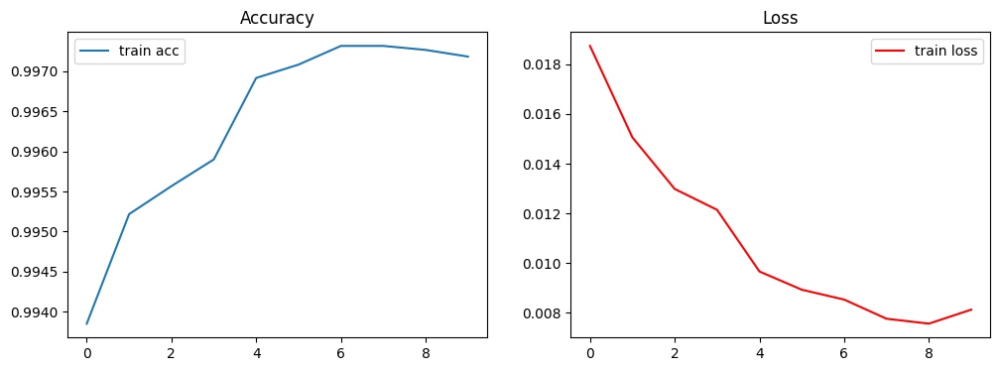
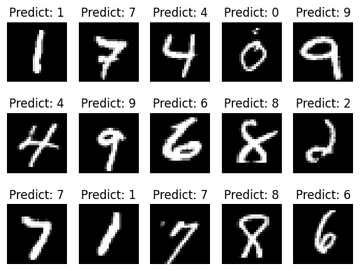
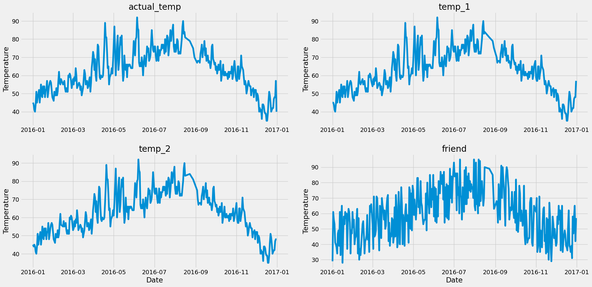
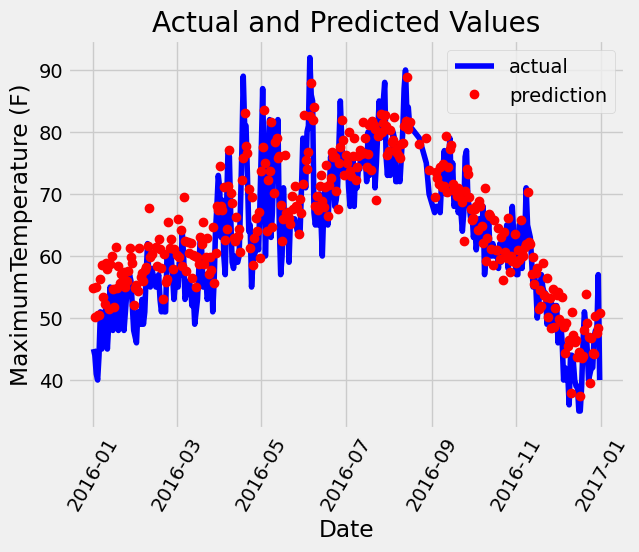

环境安装：

conda create -n tf2 python=3.10

pip install tensorflow==2.15.0

上面环境可使用tf.keras，无error

若在vscode使用jupyter，可执行：pip install ipykernel

其他常用的包：pip install matplotlib，pip install scikit-learn

1.MNIST代码部分：model.summary()如下

Layer (type)                Output Shape              Param #   

 conv2d_2 (Conv2D)           (None, 24, 24, 6)         156       
                                                                 
 max_pooling2d_2 (MaxPoolin  (None, 12, 12, 6)         0         
 g2D)                                                            
                                                                 
 conv2d_3 (Conv2D)           (None, 8, 8, 16)          2416      
                                                                 
 max_pooling2d_3 (MaxPoolin  (None, 4, 4, 16)          0         
 g2D)                                                            
                                                                 
 flatten_2 (Flatten)         (None, 256)               0         
                                                                 
 dense_5 (Dense)             (None, 120)               30840     
                                                                 
 dense_6 (Dense)             (None, 84)                10164     
                                                                 
 dense_7 (Dense)             (None, 10)                850       
                                                                 
=================================================================
Total params: 44426 (173.54 KB)
Trainable params: 44426 (173.54 KB)
Non-trainable params: 0 (0.00 Byte)
_________________________________________________________________

训练与损失图像：

简单预测结果（摘取测试集的15个样本）：

---

2.天气预测方面

model.summary()如下

Model: "sequential_6" 

Layer (type)                Output Shape              Param #    

dense_18 (Dense)            (None, 16)                240                                                                         dense_19 (Dense)            (None, 32)                544                                                                         dense_20 (Dense)            (None, 1)                 33                                                                          ================================================================= 

Total params: 817 (3.19 KB) 

Trainable params: 817 (3.19 KB) 

Non-trainable params: 0 (0.00 Byte)

data_visualization:

predict vs actual:

